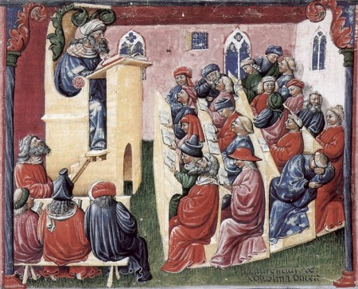
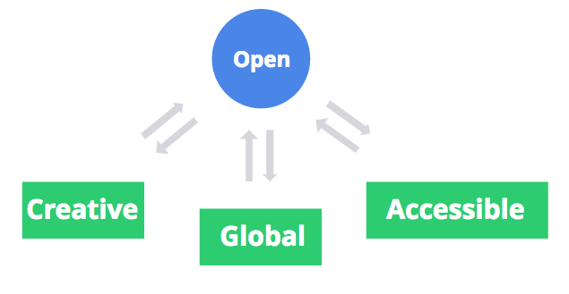

# Open Education Manifesto
----

##About the manifesto

  The Open Education Manifesto is supposed to be an open source manifesto created through the vision and collaboration of leaders and students who want to improve the education system. Our goal is to define the future of education and unite leaders from different industries to advance education. As a privileged student who has access to top-notch education, I recognize it is my duty to collaborate to a better education system for the future generations.
	
##The history of education

  Our education system dates back from the 18th century, from the Prussian education system. Its focus was to create a universal education system, giving everyone access to basic education by establishing a national curriculum and national testing, but completely ignoring the idea of personalized education. It focused on providing a background needed in an early industrialized world.

  Everything around us has changed since then. We have phones, cars, computers and live in a completely different way. The abilities to come up with creative solutions, explore the intersection of different fields and to have a global perspective have never been so important. Everything went through dramatic changes, except for education. Education works in a way that is very similar to how it worked centuries ago — in most schools, we have one teacher lecturing in front of a big class with very little interaction between them, just like in the Middle Ages. Is that really the best way to teach? 
  
  
  
##The future of education

  The new challenge in education is to create an education system that can attend each student’s unique needs and can, at the same time, be accessible to everyone. Our new education system should be global, accessible and creative.

  Our current world requires an education system that can provide students customized education because they all have different needs. It should be flexible enough to let them explore other talents that would, otherwise, be wasted because students don't get to study non-traditional subjects. We need personalized education to encourage students to be creative leaders — we don’t need an education that kills creativity. It should also give students a global perspective and be accessible, open to everyone.
  
  
  
##Feel free to collaborate to the manifesto 
